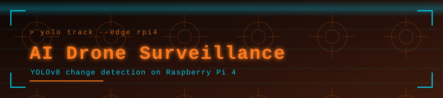

<p align="center">
  
</p>

<p align="center">
  
</p>

<p align="center">
  <a href="https://github.com/muqeetahmaad9/ai-drone-surveillance-yolov8/stargazers"></a>
  <a href="https://github.com/muqeetahmaad9/ai-drone-surveillance-yolov8/commits"></a>
  
</p>

---

### 📖 Overview

An edge surveillance system that compares a baseline video against a live feed with YOLOv8, flagging objects that appear or disappear. Built to run on a Raspberry Pi 4.

### ✨ Features

- Compares a baseline video against the current feed
- YOLOv8 object detection at the edge
- Flags newly appeared and missing objects
- Runs on Raspberry Pi 4

### 🧰 Built With

<p align="left">
  
</p>

### 🚀 Getting Started

```bash
pip install ultralytics opencv-python
python main.py
```

### 👤 Author

**Muqeet Ahmad** — AI/ML Engineer · IoT & Embedded Systems Builder

<p align="left">
  <a href="https://www.linkedin.com/in/muqeet--ahmad/"></a>
  <a href="https://muqeetahmaad-portfolio.netlify.app/"></a>
  <a href="mailto:muqeetahmad155@gmail.com"></a>
</p>

<p align="center">
  
</p>
